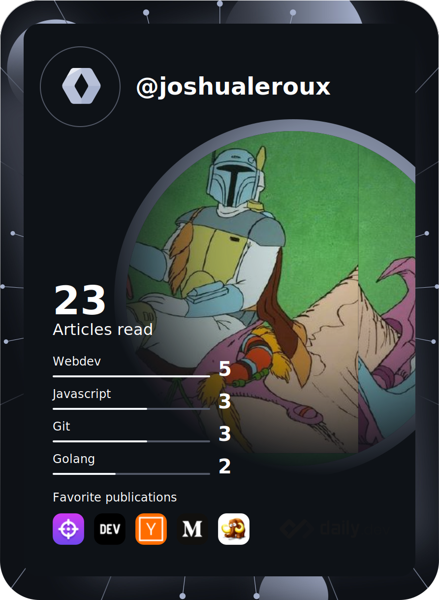

  

  
  

  

 

<h1 align="center">
  hello there :vulcan_salute:
</h1>

### :man_technologist: About Me :
- :telescope: I’m a matric student at Maritzburg College.

- :seedling: Learning Delphi, HTML, and SQL.

- :zap: In my free time, I manage my home server. 

---

### :hammer_and_wrench: Languages and Tools :

  &nbsp;
  &nbsp;
  &nbsp;
  &nbsp;
  &nbsp;
  &nbsp;
  &nbsp;
  &nbsp;
  &nbsp;
  &nbsp;
  &nbsp;
  

---

### :fire: My Stats :

 
 

---

### :books: Education:

  <a href="https://ridgejp.co.za/">
    &nbsp&nbsp&nbsp&nbsp&nbsp&nbsp&nbsp&nbsp;
  </a>
  <a href="https://www.pelham.co.za/">
    &nbsp;
  </a>
  

---
